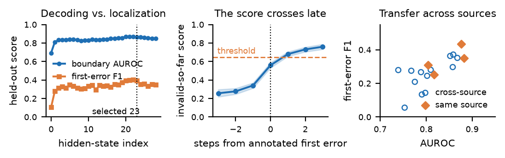
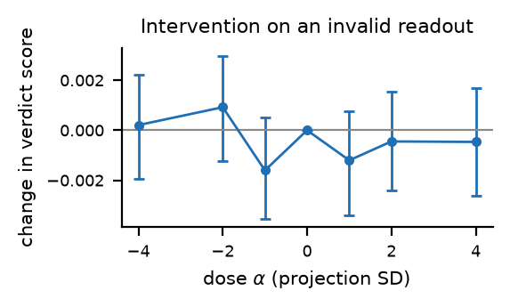

# Decodability is not localization

A project report on probing Qwen2.5-Math-1.5B-Instruct for mathematical error detection

The question this project started with was whether a language model, while reading a worked solution, internally registers the moment the argument stops being correct. If it does, a linear read of the residual stream should be able to tell you. That much turned out to be true. Almost everything I actually wanted to conclude from it turned out not to be.

The short version: a probe on the selected layer decodes "this prefix has already gone wrong" with held-out AUROC 0.866, and that is a real result. But the same score names the first wrong step in 28.9 percent of erroneous traces, fires roughly half a step late, and fires on 38.8 percent of solutions that were never wrong at all. Its ranking transfers across data sources; its threshold does not. And the causal test never ran, because the model's own verdict about its own reasoning came out below chance on the exact boundaries the intervention would have used. None of those four facts is visible in the number 0.866.

This report consolidates every result from the frozen primary run, the CPU follow-up, and the post-hoc extended analyses. The manuscript version is in paper/ when present. All numbers map to artifacts listed in the artifact map at the end, with `results/experiment.md` retained as the narrow experiment record.

## 1. Setup

### 1.1 Model and data

The model is `Qwen/Qwen2.5-Math-1.5B-Instruct` ([Yang et al., 2024](https://arxiv.org/abs/2409.12122)) reading [ProcessBench](https://aclanthology.org/2025.acl-long.50/) ([Zheng et al., 2025](https://aclanthology.org/2025.acl-long.50/)), which annotates the earliest erroneous step in solutions drawn from GSM8K, MATH, OlympiadBench, and Omni-MATH ([Cobbe et al., 2021](https://arxiv.org/abs/2110.14168); [Hendrycks et al., 2021](https://arxiv.org/abs/2103.03874); [He et al., 2024](https://arxiv.org/abs/2402.14008); [Gao et al., 2024](https://arxiv.org/abs/2410.07985)). The model never generates these traces. It reads each fixed one in a single causal forward pass, and extraction records the 1,536-dimensional residual stream state at every step boundary across all 29 hidden-state indices (index 0 is the embedding output, indices 1 through 28 are successive transformer states).

Of 3,400 attempted traces, 3,360 were retained and 24,909 step boundaries recorded. The 40 exclusions were prompts longer than the 2,048 token limit, dropped rather than truncated: 27 from train, 4 from validation, 9 from test. Data counts after retention are in Section 2.1.

Prompts used numbered reasoning blocks followed by an end marker and a correctness question:

```text
[Step 0]
<step text>
<<END_STEP_0>>
...
[Question] Is the reasoning valid through the last step? Answer exactly CORRECT or INCORRECT.
```

The wrapper used a causal forward pass over the complete trace and recorded the residual stream state at the final token of every end marker. Causal attention prevents later tokens from changing an earlier boundary state.

### 1.2 Resolved configuration for the frozen primary run

The frozen primary artifacts were produced from a notebook-resolved configuration, not directly from the checked-in `configs/project.yaml`. The notebook kept the scientific settings but changed runtime paths, batch sizes, and dtype. `artifacts/qwen2.5-math-1.5b/experiment_config.yaml` is the authority for the primary GPU run.

| Setting | Resolved primary-run value |
|---|---|
| Seed | `42` |
| Model | `Qwen/Qwen2.5-Math-1.5B-Instruct` |
| Device | CUDA GPU, selected by `device: auto` |
| Model dtype | `bfloat16` |
| Maximum complete prompt length | `2,048` tokens |
| Dataset | `Qwen/ProcessBench` |
| Dataset splits | `gsm8k`, `math`, `olympiadbench`, `omnimath` |
| Examples per split | All available examples |
| Activation output | `/content/drive/MyDrive/math-error-tracing/artifacts/qwen2.5-math-1.5b-a100-bf16` in the resolved run |
| Activation shard size | `100` traces |
| Extraction batch size | `16` |
| Intervention batch size | `8` |
| Probe target | `invalid_so_far` |
| Partition fractions | `60%` train, `20%` validation, `20%` test |
| Probe regularization grid | `C in {0.01, 0.1, 1.0, 10.0}` |
| Probe optimizer iterations | `2,000` maximum |
| Bootstrap samples for primary probe summaries | `1,000` |
| Threshold grid | `0.05` through `0.95`, step `0.005` |
| Intervention doses | `alpha in {-4, -2, -1, 0, 1, 2, 4}` |
| Intervention examples | `128` valid-so-far and `128` invalid-so-far boundaries |
| Random directions | `20`, orthogonal to the learned direction |

The checked-in config currently says `float16`, extraction batch size `1`, intervention batch size `1`, and `exploratory_bootstrap_samples: 2000`. The frozen run instead records `bfloat16`, batch sizes `16` and `8`, and `exploratory_bootstrap_samples: 0`. The dataset fingerprint in the extraction identity is `447f0a4b35c5747a9f9a3dab1e70d43f71efd501497b8cec668b71337099784a`. The repository does not preserve the exact GPU model name, wall clock duration, or primary extraction progress file.

### 1.3 Partitions and labels

Problems were normalized by collapsing whitespace and case folding, then grouped by the first 16 hexadecimal characters of a SHA-1 hash of the normalized problem text. All traces and steps in one problem group were assigned to one partition. Groups were stratified by source and whether any member trace contained an error. Within each stratum, groups were ordered by a seeded SHA-256 digest and allocated approximately 60/20/20 to train, validation, and test. Seed 42 gives 669 test traces (432 erroneous, 237 fully correct) and 4,985 test boundaries.

The target at boundary k of trace i is `invalid_so_far`:

```
y_{ik} = 1[e_i >= 0 and k >= e_i]
```

where `e_i` is the annotated first error index and `-1` means fully correct. It is 1 at the first annotated error and remains 1 for every later boundary. It does not claim the current step is locally wrong, and that detail matters for how the results read.

### 1.4 Probe fitting and selection

At each hidden-state index a standardized, class-balanced L2 logistic probe was fit:

```
P(y_{ik}=1 | h_{ik}^{(l)}) = sigma(w_l^T h_{ik}^{(l)} + b_l)
```

`C` was selected from `{0.01, 0.1, 1, 10}` by validation AUROC. The probability threshold was selected on validation Process F1 over the threshold grid. The layer was selected by validation Process F1, with validation AUROC as tie breaker. This selected layer 23, `C = 0.01`, and threshold `0.645`. The probe was refit on train plus validation and evaluated once on test. The predicted first error is the first threshold crossing, or -1 if the score never crosses. Intervals are whole-trace bootstraps, which keeps steps from the same solution together. Every nuisance control received the same selection budget: same `C` grid, validation-selected threshold, refit on train plus validation, inverse boundary-count weights so each trace contributes equal training loss.

### 1.5 Run ledger

| Run | Scope | Inputs | Status | Main output |
|---|---|---|---|---|
| Experiment 1 | Model extraction, hidden-state probes, controls, transfer, and gated verdict intervention | ProcessBench, Qwen2.5-Math-1.5B-Instruct, GPU | Complete | `artifacts/qwen2.5-math-1.5b/` |
| Experiment 2 | CPU analyses of frozen predictions and intervention records | Experiment 1 artifacts only | Complete | `artifacts/experiment2_cpu/` |
| Experiment 3A | Matched error-onset transition probe | Experiment 1 activation shards | Complete, post-hoc | `artifacts/experiment3_extended/transition_probe/` |
| Experiment 3B | Natural-token versus artificial-marker boundary control | New boundary activation extraction plus frozen selection | Complete, post-hoc | `artifacts/experiment3_extended/boundary_control/` |
| Experiment 3C | Conditional hidden-state versus nuisance-feature comparison | Experiment 1 activation shards and frozen partitions | Complete, post-hoc | `artifacts/experiment3_extended/conditional_hidden_state/` |
| Experiment 3D | Contextual visible-prefix baseline | ProcessBench prefixes and Experiment 1 shard metadata | Complete, post-hoc | Consolidated here from `results/contextual_baseline_20260902T220704Z.md` (see Section 4.4) |
| Experiment 3E | Counterfactual activation patching | Human-verified corrected steps required | Pending | No patching artifact |

Experiment 2 and Experiment 3 were designed after inspecting the primary results. They are robustness or diagnostic analyses, not untouched confirmations of the primary hypothesis.

## 2. Primary results

### 2.1 Held-out step decoding

At the validation-selected layer 23, frozen test results on 4,985 boundaries were:

| Metric | Test estimate | Whole-trace 95% interval |
|---|---:|---:|
| AUROC | 0.866 | [0.849, 0.884] |
| Average precision | 0.843 | [0.813, 0.870] |
| Balanced accuracy | 0.780 | [0.762, 0.800] |
| Precision | 0.809 | [0.773, 0.843] |
| Recall | 0.686 | [0.652, 0.720] |
| Specificity | 0.874 | [0.852, 0.895] |
| Step F1 | 0.743 | [0.716, 0.769] |
| Brier score | 0.150 | [0.139, 0.160] |
| Log loss | 0.458 | [0.429, 0.486] |
| Expected calibration error | 0.046 | [0.030, 0.070] |

Data composition of the test partition:

| Quantity | Count |
|---|---:|
| Retained traces | 669 |
| Erroneous traces | 432 |
| Fully correct traces | 237 |
| `invalid_so_far = 1` boundaries | 2,181 |
| `invalid_so_far = 0` boundaries | 2,804 |
| Final answer correct | 350 |
| Final answer incorrect | 319 |

| Source | Retained traces | Retained boundaries |
|---|---:|---:|
| GSM8K | 84 | 439 |
| MATH | 204 | 1,387 |
| OlympiadBench | 188 | 1,661 |
| Omni-MATH | 193 | 1,498 |

The numerically highest test AUROC was 0.868 at layer 22. It was not selected because layer choice was locked from validation before test evaluation.

### 2.2 Localization

Using the layer 23 threshold 0.645, the first threshold crossing produced:

| Metric | Estimate |
|---|---:|
| Exact first-error accuracy among erroneous traces | 0.289 |
| Correct rejection of fully correct traces | 0.612 |
| Process F1 | 0.393 |
| Exact complete-trace outcome | 0.404 |
| Error detected somewhere | 0.887 |
| Within one step | 0.593 |
| Within two steps | 0.727 |
| Mean signed localization error among detections | +0.587 steps |
| Mean absolute localization error among detections | 1.397 steps |

Whole-trace bootstrap intervals for the main localization quantities:

| Metric | Estimate | 95% interval |
|---|---:|---:|
| Correct-trace accuracy | 0.611 | [0.554, 0.673] |
| Error-step accuracy | 0.291 | [0.246, 0.332] |
| Process F1 | 0.393 | [0.351, 0.436] |
| Exact complete-trace outcome | 0.404 | [0.368, 0.442] |
| Detection rate | 0.887 | [0.854, 0.917] |
| Within one step | 0.594 | [0.547, 0.638] |
| Within two steps | 0.728 | [0.687, 0.770] |
| Mean signed error | +0.583 | [+0.362, +0.796] steps |
| Mean absolute error | 1.393 | [1.241, 1.557] steps |

The positive signed error indicates detections were late on average. Within an erroneous trace the probe orders boundaries nearly perfectly: mean within-trace AUROC is 0.968 [0.958, 0.976] across the 380 test traces whose first error is not at step 0. Any score that rises monotonically with step index can produce this, and with a persistent label there is every reason for the score to rise. The figure below shows why thresholded localization lags.



Mean score is 0.341 one step before the annotated error, 0.559 at onset, 0.680 one step after, 0.731 two steps after. The operating threshold is 0.645. At onset the average trace is still below threshold. The score does not step; it ramps over several boundaries around the error, and a fixed threshold placed on a ramp always crosses late. Correct traces drift upward too, with the same ramp and no error to explain it.

### 2.3 Controls

Primary test used three controls with the same held-out traces and selection budget. Values below are descriptive held-out differences; paired intervals are in Section 3.3.

| Predictor | AUROC | Average precision | Step F1 | Process F1 | Exact complete-trace outcome |
|---|---:|---:|---:|---:|---:|
| Hidden state, layer 23 | **0.866** | **0.843** | **0.743** | **0.393** | **0.404** |
| Current-step TF-IDF | 0.733 | 0.667 | 0.490 | 0.254 | 0.260 |
| Position | 0.730 | 0.621 | 0.359 | 0.054 | 0.108 |
| Shuffled-label hidden state | 0.518 | 0.436 | 0.275 | 0.179 | 0.184 |

Among the 432 erroneous test traces, the hidden-state score had AUROC 0.873, average precision 0.925, balanced accuracy 0.782, and step F1 0.785 when pre-error and post-error boundaries were compared within erroneous traces.

### 2.4 Cross-source transfer

At layer 23 a separate probe was trained on each source training partition, threshold chosen on that source validation partition, then evaluated on all four source test partitions.

Step AUROC:

| Train \ Test | GSM8K | MATH | OlympiadBench | Omni-MATH |
|---|---:|---:|---:|---:|
| GSM8K | 0.817 | 0.802 | 0.753 | 0.791 |
| MATH | 0.775 | 0.877 | 0.789 | 0.858 |
| OlympiadBench | 0.739 | 0.852 | 0.804 | 0.868 |
| Omni-MATH | 0.768 | 0.859 | 0.810 | 0.882 |

All 12 off-diagonal AUROCs were above 0.739. Mean off-diagonal AUROC was 0.805; mean diagonal was 0.845. Ranking transfer is consistent.

Process F1:

| Train \ Test | GSM8K | MATH | OlympiadBench | Omni-MATH |
|---|---:|---:|---:|---:|
| GSM8K | 0.253 | 0.245 | 0.055 | 0.134 |
| MATH | 0.209 | 0.433 | 0.267 | 0.297 |
| OlympiadBench | 0.279 | 0.363 | 0.309 | 0.351 |
| Omni-MATH | 0.275 | 0.371 | 0.280 | 0.349 |

Mean off-diagonal Process F1 was 0.261 versus 0.336 on the diagonal. The worst cell is GSM8K to OlympiadBench, where AUROC holds at 0.753 while Process F1 collapses to 0.055. A threshold fitted on short grade-school traces fires on 97 percent of correct OlympiadBench solutions. The direction survives the move; calibration does not, because trace length changes underneath it. These are four sources inside one benchmark construction, not four independent datasets, and they say nothing about another model family or size.

### 2.5 Primary intervention result

The probe standardized weights were converted to raw hidden-state coordinates and normalized to a unit direction `v`. The intervention scale was the standard deviation of train plus validation projections onto `v`. For one boundary from each of 256 distinct held-out traces, the state entering the selected decoder layer was changed to `h' = h + alpha sigma_v v` at `alpha = -4, -2, -1, 0, 1, 2, 4`. The behavior readout used the separate `step-error-yes-no-v1` prompt and measured `m = P(Yes) - P(No)`, where Yes means the reasoning contains an error, as conditional single-token next-token probabilities under teacher forcing. Positive `m` favors Yes.

The workflow first scored unmodified boundaries. Its stored baseline was AUROC `0.342`, specificity `0.203`, and zero-threshold accuracy `0.371` over 256 boundaries. An earlier single-token CORRECT/INCORRECT readout was worse, at AUROC 0.283 and specificity zero. Because this readout was weak and below chance in ranking, the dose-response result is evidence only about this readout under this intervention. The pipeline gates causal analysis on the readout clearing AUROC 0.5 with nonzero specificity, so the intervention is recorded as an assay diagnostic.

Learned-direction paired changes in `P(Yes) - P(No)`:

| `alpha` | Mean paired change | 95% interval |
|---:|---:|---:|
| -4 | +0.000207 | [-0.001941, +0.002227] |
| -2 | +0.000922 | [-0.001233, +0.002976] |
| -1 | -0.001605 | [-0.003552, +0.000497] |
| 0 | 0 | [0, 0] |
| +1 | -0.001201 | [-0.003416, +0.000777] |
| +2 | -0.000447 | [-0.002403, +0.001535] |
| +4 | -0.000466 | [-0.002607, +0.001679] |

Every nonzero-dose interval includes zero. Estimated dose slope was `-0.000120`; rank monotonicity across the seven means was `-0.500`; hypothesized sign occurred for 23.4 percent of individual nonzero interventions. At the extreme doses learned-direction changes did not show a reliable advantage over 20 random orthogonal directions on the matched 32-example subset. Empirical one-sided values were `1.0` at `alpha = -4` and `0.0476` at `alpha = +4` under the stored comparison procedure. The artifact contains 1,792 learned-direction rows and 1,280 random-direction rows. The smallest detectable effect at 80 percent power was 0.0029.

None of that is evidence about the model. Testing use requires a behavioral readout that separates valid from invalid prefixes before any intervention touches it. Without that, a flat dose-response curve is unreadable. This was the correct outcome to have and the worse one to write up.



## 3. Post-hoc CPU follow-up

### 3.1 Protocol

The CPU follow-up reused the 4,985 frozen test predictions and intervention records. It loaded no language model and no activation tensor and fit no new hidden-state probe. It used seed 42, 5,000 within-trace circular-shift randomizations, 2,000 grouped bootstrap draws, and 95 percent intervals. It was designed after inspecting primary results and is not an independent confirmation.

### 3.2 Temporal alignment and onset change

Circularly shifting each score trajectory within its trace 5,000 times preserves values and destroys alignment, giving a null exact rate of 0.164 [0.137, 0.192] against observed 0.289 (p = 0.0002), and null Process F1 of 0.259 against observed 0.393 (p = 0.0002). Within-one-step localization was 0.593 versus null mean 0.436 (p = 0.0002). The observed score is aligned with the annotation beyond this within-trace shifted null. This test does not by itself remove absolute-position explanations.

The mean score jump at the annotated first error was 0.257. A metadata-matched transition from a fully correct trace changed by 0.113. The paired difference was 0.144 with 95 percent interval [0.096, 0.193]. The analysis used 380 erroneous traces whose first error occurred after step 0 and 139 unique correct placebo traces. Correct traces also showed positive score drift.

Subtracting each eligible erroneous trace first-step score left pooled AUROC at 0.881 [0.862, 0.900]. Mean AUROC calculated separately within traces was 0.968. The score therefore retained pre-error versus post-error ordering after removing a stable trace-level offset.

### 3.3 Failure patterns and threshold sensitivity

The strongest failure pattern was false alarms on long traces. Complete-trace accuracy fell from 0.491 in the shortest trace-length quartile to 0.264 in the longest; correct-trace rejection fell from 0.719 to 0.350. By token-count quartile, correct rejection fell from 0.792 to 0.231. Across sources, complete-trace accuracy was 0.512 on GSM8K, 0.500 on MATH, 0.298 on OlympiadBench, and 0.358 on Omni-MATH. These comparisons are descriptive and post-hoc.

Thresholds fitted separately by trace-length bin did not improve the frozen test result: Process F1 fell from 0.393 to 0.377, and correct rejection fell from 0.612 to 0.540. Trace-equal weighting also changed AUROC only from 0.866 to 0.867, difference +0.001 with 95 percent interval [-0.007, +0.010].

### 3.4 Equally tuned shortcut controls

All shortcut models received the same `C` grid, validation selection protocol, refit on train plus validation, and inverse boundary-count weights so each trace contributed equal total training loss.

| Control | `C` | AUROC | Process F1 | Exact error | Correct rejection |
|---|---:|---:|---:|---:|---:|
| Hidden state, frozen | 0.01 | 0.866 | 0.393 | 0.289 | 0.612 |
| Prefix TF-IDF | 10.0 | 0.751 | 0.274 | 0.192 | 0.477 |
| Structural metadata | 10.0 | 0.776 | 0.168 | 0.148 | 0.194 |
| Metadata + final outcome | 1.0 | 0.854 | 0.262 | 0.164 | 0.646 |
| Joint text + metadata | 1.0 | 0.810 | 0.210 | 0.169 | 0.278 |
| Joint text + metadata + outcome | 1.0 | 0.874 | 0.294 | 0.176 | 0.895 |

Final-answer correctness is a benchmark annotation unavailable to an online detector. The last two rows are oracle-assisted diagnostic controls, not deployable baselines. The joint text plus metadata control remains below the hidden probe on AUROC and Process F1. The oracle-assisted control has slightly higher AUROC, with hidden-minus-control difference -0.008 [-0.028, +0.013], while the hidden probe has higher exact error localization by +0.113 [0.064, 0.163] and lower correct rejection by -0.283 [-0.347, -0.218].

| Predictor | AUROC | Process F1 | Exact error | Correct rejection |
|---|---:|---:|---:|---:|
| Hidden state, layer 23 | .866 | .393 | .289 | .612 |
| Prefix TF-IDF | .751 | .274 | .192 | .477 |
| Prefix MiniLM embeddings (post-hoc, single run) | .753 | .268 | not reported | not reported |
| Structural metadata | .776 | .168 | .148 | .194 |
| Text + metadata | .810 | .210 | .169 | .278 |
| Metadata + final answer (diagnostic) | .854 | .262 | .164 | .646 |
| Text + metadata + final answer (diagnostic) | .874 | .294 | .176 | .895 |

Adding the hidden state to prefix text plus structural metadata under trace-equal protocol improves AUROC by +0.0587 [0.0414, 0.0745] and log loss by -0.0798 [-0.1038, -0.0548] (intervals exclude zero on this split). Against another trace-equal conditional framing, `N+H` versus `N` improves AUROC by +0.059 [0.041, 0.075] and reduces log loss by -0.080 [-0.104, -0.055]. Measured against prefix TF-IDF alone the gap is 0.115, about twice what survives the joint nuisance model; against nothing at all the reader sees 0.866 versus chance. Which comparison you print changes the apparent finding by a factor of two.

Direct conditional comparison with `N` as prefix text plus structural metadata and `H` as the full selected-layer hidden representation:

| Condition | AUROC | Log loss | Process F1 | Δ AUROC vs nuisance only |
|---|---:|---:|---:|---|
| `N` | .811 | .533 | .211 |  |
| `N+H` | .869 | .454 | .397 | +.0587 [.0414, .0745] |
| `O` (adds final answer) | .874 | .440 | .284 |  |
| `O+H` | .909 | .385 | .444 | +.0348 [.0242, .0451] |
| `H` alone | .868 | .457 | .397 |  |

The check passes, but notice the size of what survives.

## 4. Post-hoc extended analyses

### 4.1 Matched error-onset transition probe

A probe was fit on the onset difference `h[e] - h[e-1]` rather than on the state itself. For each eligible erroneous trace, the activation difference from the last valid boundary to the annotated first-error boundary was paired with a transition from a fully correct trace. Matching preferred source and generator, then minimized differences in relative position, trace length, and token count. Original problem-grouped partitions remained fixed.

There were 1,919 pairs across all partitions and 380 held-out test pairs. The 1,919 pairs used 687 unique placebo traces. Placebo reuse had median 2, 90th percentile 6, and maximum 46. Standardized differences after matching were -0.011 for relative position, 0.146 for trace length, and 0.285 for token count.

A validation-selected L2 transition probe used layer 21 and `C = 0.01`. On held-out pairs:

| Metric | Estimate | 95% interval |
|---|---:|---:|
| AUROC | 0.769 | [0.713, 0.820] |
| Average precision | 0.741 | [0.672, 0.816] |
| Paired accuracy | 0.753 | [0.676, 0.824] |

Controls were position AUROC 0.631, destination-step TF-IDF AUROC 0.671, and shuffled-label hidden AUROC 0.585. This supports a linearly distinguishable change at annotated onsets relative to matched transitions. It does not show the change is abrupt, and reuse and residual matching imbalance make this an exploratory result, not a finding. One-to-one and inverse-reuse sensitivity refits were implemented but have no completed artifact in the frozen record. When run, `transition-sensitivity` writes `matching_sensitivity.csv`, `matching_sensitivity_bootstrap.csv`, and `matching_sensitivity_diagnostics.csv`; these artifacts are not present.

### 4.2 Natural-token boundary control

A separate extraction recorded the hidden state at both the last non-whitespace token of each written step and the final token of its artificial end marker. The comparison fixed layer 23 and `C = 0.01`, then evaluated both locations on the original test partition.

| Location | AUROC | Process F1 | Exact first error | Within one step |
|---|---:|---:|---:|---:|
| Last natural step token | 0.868 | 0.420 | 0.329 | 0.572 |
| End-marker token | 0.866 | 0.393 | 0.289 | 0.593 |

Natural-token minus marker-token differences were +0.002 AUROC [-0.007, +0.011] and +0.026 Process F1 [-0.020, +0.075] under paired whole-trace bootstrap. Intervals include zero. The decodable signal is not specific to the artificial marker location.

### 4.3 Conditional nuisance comparison

This post-hoc analysis compared prefix text (`N`), hidden state (`H`), and their combinations under trace-equal training weights. At layer 23, adding hidden state to prefix text (`N+H`) produced AUROC 0.869 and Process F1 0.397, compared with AUROC 0.811 and Process F1 0.211 for prefix text alone. Paired `N+H - N` AUROC difference was +0.059 [0.041, 0.075]. The feature block also included an oracle-assisted final-answer outcome; that outcome is not available to an online monitor.

### 4.4 Contextual visible-prefix baseline

The contextual baseline encoded only the problem and prefix through the current boundary using mean-pooled `sentence-transformers/all-MiniLM-L6-v2` embeddings. It selected `C = 0.01` with validation AUROC 0.7584. On 669 held-out traces it reached AUROC 0.7532, average precision 0.6725, log loss 0.5961, and Process F1 0.2684. No future steps, final-answer correctness, or target-model hidden states were used. Run identifier is `20260902T220704Z`; encoder revision was `None` (unpinned); resolved configuration SHA-256 is `c2bea92a7461e9f3ffdca2c49d4480b6205aa73583e2cb551931175a564514cb`. The point estimates are below the layer 23 hidden probe (0.866), but this is one post-hoc unpaired run with no paired uncertainty artifact, no exact localization metrics, and no pinned encoder revision. It does not exhaust visible-text representations and does not establish that hidden states contain information unavailable to every visible-text encoder. This result was previously recorded in `results/contextual_baseline_20260902T220704Z.md` and is consolidated here.

## 5. Counterfactual patching status

A 160-pair template was generated from selected erroneous traces. It contains the problem, the prefix before the first error, the original erroneous step, a proposed corrected step, annotation notes, and a verification flag. The current annotation inventory has 135 drafted corrections and 25 withheld items. Withheld items require a full solution, a change to the overall solution route, or access to a figure that could not be checked from text.

Patching requires a human reviewer to verify each correction and set `verified: true`. The loader also requires a nonempty corrected step distinct from the original error step and refuses to run on any pair without verification. No activation-patching result is reported because the verification gate has not been completed. It also inherits the same failed behavioral gate as the steering experiment, so clearing the annotation backlog alone would not make it interpretable.

## 6. What I take from this

Four things generalize past this model, and each costs almost nothing to check.

1. Report the decision rule, not the ranking. Within-trace AUROC 0.968 and exact localization 28.9 percent come out of the same predictions. If the claim is that a model knows when its reasoning went wrong, AUROC cannot answer it because AUROC never touches the threshold.

2. Give the nuisance model the probe fit selection budget. An undertuned baseline makes the gap look twice its size, and with no control at all the reader is just comparing 0.866 against chance.

3. Watch for benchmark bookkeeping in the feature set. Final-answer correctness lifts a nuisance model to AUROC 0.874, past the probe, while being a field no online detector could read. It sits in the metadata and is easy to include without noticing.

4. Gate causal claims on assay validity. Decodability does not imply use ([Hewitt and Liang, 2019](https://aclanthology.org/D19-1275/); [Belinkov, 2022](https://doi.org/10.1162/coli_a_00422); [Elazar et al., 2021](https://aclanthology.org/2021.tacl-1.10/)), and the standard steering methods ([Meng et al., 2022](https://arxiv.org/abs/2202.05262); [Turner et al., 2023](https://arxiv.org/abs/2308.10248); [Li et al., 2023](https://arxiv.org/abs/2306.03341)) only tell you something if the behavior you are perturbing was measurable to begin with.

The related literature reaches compatible conclusions from other directions. [Yuan et al. (2026)](https://arxiv.org/abs/2605.09502) separate diagnostic error awareness from causal use across several models. [Bertolazzi et al. (2025)](https://aclanthology.org/2025.emnlp-main.1495/) find models that compute arithmetic without validating it. [Srivatsa et al. (2025)](https://aclanthology.org/2025.emnlp-main.553/) find that models cannot spot math errors even when shown the solution. Meanwhile hidden-state step scorers are already being used for test-time scaling and trace pruning ([Ni et al., 2026](https://aclanthology.org/2026.acl-long.536/); [Liang et al., 2026](https://aclanthology.org/2026.findings-acl.1336/)), which is what makes the distinction between ranking and thresholded localization a practical question rather than a methodological one.

## 7. Limitations

- One 1.5-billion-parameter model and one frozen dataset partition were tested.
- ProcessBench was repartitioned for representation analysis; these are not standard benchmark scores.
- The `invalid_so_far` target propagates the first-error label to all later steps, so pooled metrics reward accumulated evidence and not necessarily error detection at the onset.
- Prompt text, step structure, generator, trace length, and final-answer metadata can carry shortcuts.
- Long traces are overrepresented among false alarms, and 40 of 3,400 traces exceeded the context limit and were excluded.
- The transition analysis reuses placebo traces, with maximum reuse 46, and has residual matching imbalance in length and token count.
- The intervention changes one boundary state at one decoder layer and uses one teacher-forced single-token readout.
- The CPU and extended analyses were selected after inspecting primary results and are not independent confirmations.
- The contextual MiniLM baseline is one unpaired post-hoc run with an unpinned encoder revision and does not rule out other visible-text encoders.
- Calibration is reported as log loss and Brier score with no reliability analysis.
- Temporal, boundary-location, transition, and semantic-baseline analyses were all designed after the primary result was known, so intervals describe resampling uncertainty inside a completed pipeline rather than sensitivity to a fresh split.
- The primary artifacts do not preserve the GPU host name, wall clock duration, or full extraction progress log.
- Grouped split, layer and `C` selection, and threshold selection have been run under one seed only; repeating across seeds needs no new extraction and is the first thing to run next.

One more thing, which belongs in any writeup of a result like this: the probe is not a grader. At its selected threshold it flags 38.8 percent of fully correct solutions as containing an error, and its correct-trace rejection varies from 0.463 on OlympiadBench to 0.786 on GSM8K. Pointing it at student work would produce frequent false accusations, distributed unevenly across problem difficulty. The supported use is as a research diagnostic sitting next to human or formal verification.

## 8. Reproducing it

Extraction needs one A100-class GPU; every analysis in this report runs on CPU against frozen predictions.

```bash
uv sync --extra dev
uv run math-error --config configs/project.yaml validate-config
uv run math-error --config configs/project.yaml run-all
uv run math-error --config configs/project.yaml analyze
uv run math-error --config configs/project.yaml fit-conditional
uv run math-error --config configs/project.yaml fit-contextual-baseline
uv run math-error --config configs/project.yaml fit-transition
uv run math-error --config configs/project.yaml transition-diagnostics
uv run math-error --config configs/project.yaml transition-sensitivity
uv run math-error --config configs/project.yaml extract-boundary-controls
uv run math-error --config configs/project.yaml analyze-boundary-controls
uv run math-error --config configs/project.yaml prepare-counterfactuals
uv run math-error --config configs/project.yaml run-counterfactuals
```

The maintained equivalents for local checks are:

```bash
uv sync --extra dev
uv run math-error --config configs/project.yaml validate-config
uv run pytest
uv run ruff check src tests
```

Note that the frozen primary artifacts came from a notebook-resolved configuration, not from `configs/project.yaml` directly. The notebook kept the scientific settings and changed paths, batch sizes, and dtype. `artifacts/qwen2.5-math-1.5b/experiment_config.yaml` is the authority on what actually ran. The dataset fingerprint is `447f0a4b35c5747a9f9a3dab1e70d43f71efd501497b8cec668b71337099784a` and the dtype was bfloat16.

Primary GPU workflow with the resolved config:

```bash
uv run math-error --config <resolved-config> download-data
uv run math-error --config <resolved-config> extract-activations
uv run math-error --config <resolved-config> fit-probes
uv run math-error --config <resolved-config> run-interventions
uv run math-error --config <resolved-config> render-figures
uv run math-error --config <resolved-config> analyze
```

Extended analyses:

```bash
uv run math-error --config <resolved-config> fit-transition
uv run math-error --config <resolved-config> transition-diagnostics
uv run math-error --config <resolved-config> transition-sensitivity
uv run math-error --config <resolved-config> extract-boundary-controls
uv run math-error --config <resolved-config> analyze-boundary-controls
uv run math-error --config <resolved-config> fit-conditional
uv run math-error --config <resolved-config> fit-contextual-baseline
uv run math-error --config <resolved-config> prepare-counterfactuals
uv run math-error --config <resolved-config> run-counterfactuals
```

`run-counterfactuals` remains gated on verified corrections and a usable verdict baseline.

## 9. Artifact map

All numerical claims in this report come from these files:

| Artifact | Use |
|---|---|
| `artifacts/qwen2.5-math-1.5b/experiment_config.yaml` | Resolved primary-run configuration |
| `artifacts/qwen2.5-math-1.5b/extraction_identity.json` | Dataset fingerprint, model, dtype, context limit |
| `artifacts/qwen2.5-math-1.5b/probes/layer_metrics.csv` | Layer-wise validation and test metrics |
| `artifacts/qwen2.5-math-1.5b/probes/test_predictions.csv` | Frozen test labels, metadata, and scores |
| `artifacts/qwen2.5-math-1.5b/probes/test_group_bootstrap_summary.csv` | Whole-trace primary intervals |
| `artifacts/qwen2.5-math-1.5b/probes/controls.csv` | Primary shortcut controls |
| `artifacts/qwen2.5-math-1.5b/probes/domain_transfer.csv` | Four-source transfer matrices |
| `artifacts/qwen2.5-math-1.5b/probes/directions.npz` | Directions, projection scales, thresholds, selected layers |
| `artifacts/qwen2.5-math-1.5b/interventions/behavioral_verdict.json` | Native verdict baseline and readout definition |
| `artifacts/qwen2.5-math-1.5b/interventions/summary.csv` | Learned and random intervention scores |
| `artifacts/qwen2.5-math-1.5b/interventions/effect_statistics.csv` | Paired dose intervals and random-direction comparisons |
| `artifacts/experiment2_cpu/summary.json` | CPU settings, environment, and headline diagnostics |
| `artifacts/experiment2_cpu/results.md` | CPU follow-up result record |
| `artifacts/experiment2_cpu/data_flow.csv` | Attempted, retained, and over-length counts |
| `artifacts/experiment2_cpu/onset_eligibility_audit.csv` | Step 0 exclusion audit for onset analyses |
| `artifacts/experiment2_cpu/error_aligned_trajectory.csv` | Mean score trajectory around annotated error |
| `artifacts/experiment2_cpu/probe_control_paired_intervals.csv` | Paired whole-trace intervals for control differences |
| `artifacts/experiment3_extended/transition_probe/` | Matched transition probe and diagnostics |
| `artifacts/experiment3_extended/boundary_control/` | Natural-token versus marker control |
| `artifacts/experiment3_extended/conditional_hidden_state/` | Conditional nuisance comparison |
| `artifacts/experiment2_cpu/temporal_randomization_summary.csv` | Temporal shift null summary |
| `artifacts/qwen2.5-math-1.5b/figures/` | Predictive, method, and transfer figures |
| `results/figures/gap.png` and `results/figures/intervention.png` | Rendered manuscript figures used in Sections 2.2 and 2.5 |

Generated datasets, activation shards, model caches, and run outputs are not source files and should remain outside Git.

When run, `transition-sensitivity` writes `matching_sensitivity.csv` with each variant point estimate and 95 percent interval, `matching_sensitivity_bootstrap.csv` with the two-way pair and placebo-trace bootstrap summaries, and `matching_sensitivity_diagnostics.csv` with reuse and covariate-balance diagnostics. These artifacts are not present in the completed run record.

## 10. Conclusions

The completed primary and follow-up analyses support these statements:

1. At layer 23, hidden states linearly predict `invalid_so_far` on held-out ProcessBench traces with AUROC 0.866 [0.849, 0.884].
2. The score has partial temporal information: it detects 88.7 percent of erroneous traces somewhere and localizes 59.3 percent within one step, but exact localization is 28.9 percent and detections are late on average by 0.59 steps.
3. Ranking transfer is broader than threshold transfer: all cross-source off-diagonal AUROCs exceed 0.739, while Process F1 varies from 0.055 to 0.371 off diagonal.
4. The frozen score changes near the annotated error beyond circularly shifted and matched-placebo comparisons, but these analyses were post-hoc.
5. The learned-direction intervention did not produce the predicted monotonic change in the stored `P(Yes) - P(No)` readout. The readout baseline was weak (AUROC 0.342, specificity 0.203), so this is an inconclusive causal test, not proof that the representation is causally inert.
6. Counterfactual activation patching has not run because its corrections are not human-verified (135 drafted, 25 withheld).
7. One contextual visible-prefix baseline had lower point estimates than the hidden probe (AUROC 0.753 vs 0.866, Process F1 0.268 vs 0.393), but its result record has no paired intervals or pinned encoder revision and does not rule out other text encoders.

`results/experiment.md` remains the narrow experiment record. This file is the comprehensive report that integrates every result above into one place.
